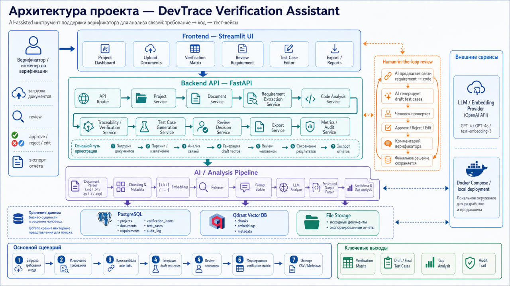
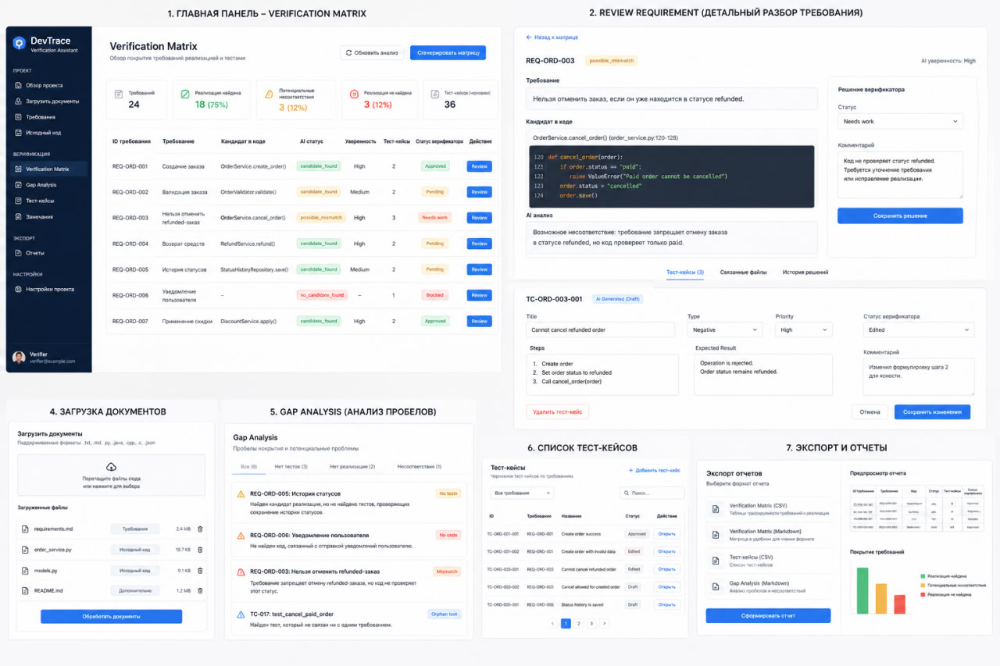

# DevTrace Verification Assistant — MVP 1

DevTrace Verification Assistant — учебный прототип инструмента для поддержки верификатора инженерного ПО: система связывает требования с фрагментами исходного кода, генерирует черновики тест-кейсов и формирует verification matrix.  
Проект не выполняет формальную верификацию, а помогает быстрее подготовить первичный анализ `требование → код → тест-кейс → решение верификатора`.  
MVP 1 сделан для курсовой работы и закладывает основу для дальнейшего развития в полноценный AI-assisted verification tool.

## Стек

- **FastAPI** — backend API для загрузки документов, запуска анализа и работы с матрицей.
- **Streamlit** — простой frontend для загрузки файлов, просмотра результатов и редактирования статусов.
- **SQLite** — локальная БД для хранения проектов, требований, фрагментов кода, тест-кейсов и решений верификатора.
- **SQLAlchemy** — работа с БД через ORM.
- **scikit-learn** — TF-IDF + cosine similarity для поиска связи между требованием и кодом.
- **pandas / csv** — экспорт verification matrix в CSV.
- **pytest** — минимальные тесты сервисного слоя.
- **Docker Compose** — локальный запуск backend и frontend.

## Короткий сценарий использования

1. Пользователь создаёт проект и загружает `requirements.md` и `source_code.py/.c`.
2. Система извлекает требования, фрагменты кода, ищет candidate links и генерирует draft test cases.
3. Верификатор просматривает verification matrix, меняет статусы/комментарии, редактирует тест-кейсы и экспортирует результат в CSV.

## Пример архитектуры проекта

## Пример UI проекта
